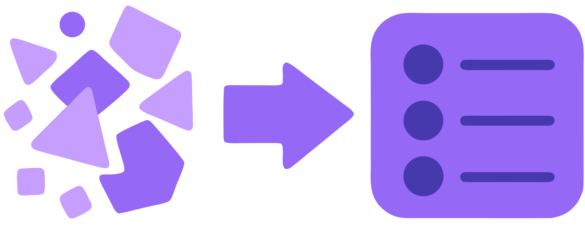

Omnitest es una herramienta de conversión de preguntas tipo test creada para carreras que tienen muchos exámenes tipo test: medicina, enfermería, derecho, oposiciones. Convierte preguntas desordenadas de múltiples fuentes en preguntas ordenadas en múltiples formatos como: Word, PDF, Anki, RemNote y quiz offline.

<p align="center">
  
</p>

<h1 align="center">Omnitest</h1>

<p align="center">
  <strong>De cualquier fuente a tests para practicar.</strong><br>
  Convierte, ordena, limpia y estructura preguntas tipo test — Daypo, PDFs escaneados,<br>
  fotos de exámenes, Word o texto mal pegado — en material listo para estudiar.
</p>

<p align="center">
  <a href="https://omnitest.streamlit.app"></a>
  &nbsp;
  <a href="CHANGELOG.md"></a>
</p>

<p align="center">
  <a href="https://omnitest.streamlit.app"><strong>omnitest.streamlit.app</strong></a>
  &nbsp;·&nbsp; Sin instalar &nbsp;·&nbsp; Tus datos no se guardan en servidor
</p>

---

## ¿Para qué sirve?

Omnitest es una herramienta de conversión de preguntas tipo test creada para carreras que tienen muchos exámenes tipo test: medicina, enfermería, derecho, oposiciones. Convierte preguntas desordenadas de múltiples fuentes en material listo para estudiar en Word, PDF, Anki, RemNote y quiz offline.

Tomas preguntas **como estén** y las devuelves limpias en **Word, PDF, Anki, RemNote, un quiz HTML offline** o un ZIP de imágenes — con o sin respuestas marcadas.

```
  Fuente          →    Revisión + IA     →    Exportar
  Daypo / PDF          limpiar / corregir      6 formatos
  foto / texto         deducir correcta
```

---

## Dos formas de meter material

| Fuente | Qué hace | ¿Necesita API? |
|--------|----------|----------------|
| **Daypo** | Detecta enlaces, descarga tests, descifra la correcta y baja imágenes | No |
| **IA** | OCR, limpieza y unificación de PDF, fotos, Word y texto pegado | Sí (plan gratis) |

En modo IA puedes usar **Google Gemini**, **Groq**, **Cerebras** o **Mistral**. Omnitest elige el modelo automáticamente y, si uno falla por cuota, prueba otro.

> **PDF e imágenes** requieren **Gemini** (multimodal). Con Groq, Cerebras o Mistral puedes procesar **texto y Word**.

---

## Seis formatos de salida

| Formato | Descripción |
|---------|-------------|
| **Word** | `.docx` con imágenes; versión con o sin respuestas |
| **PDF** | Igual que Word, listo para imprimir |
| **RemNote MCQ** | ZIP Markdown para importar tarjetas de opción múltiple |
| **Anki** | Mazo `.apkg` con opciones barajadas y feedback al responder |
| **Quiz HTML** | Mini-app offline en cualquier navegador — sin instalar nada |
| **Imágenes** | ZIP con todas las imágenes nombradas por test |

Con varios tests puedes descargar **un archivo combinado** o un **ZIP con un archivo por test**.

---

## Empezar en 30 segundos

### Online (recomendado)

1. Abre **[omnitest.streamlit.app](https://omnitest.streamlit.app)**
2. Para Daypo: pega enlaces y pulsa **Convertir**
3. Para IA: configura al menos una API en **⚙**, sube material o pega texto, **Convertir** → revisa → **Exportar**

### Local (opcional)

**Windows**

```powershell
irm https://raw.githubusercontent.com/JanitorHead/omnitest/main/install.ps1 | iex
```

**macOS / Linux**

```bash
curl -fsSL https://raw.githubusercontent.com/JanitorHead/omnitest/main/install.sh | bash
```

**Manual**

```bash
git clone https://github.com/JanitorHead/omnitest.git
cd omnitest
pip install -r requirements.txt
streamlit run app.py
```

---

## Configurar las APIs de IA

1. Pulsa **⚙** (arriba a la derecha)
2. Pega la clave de cada proveedor → **Probar** → activa **Usar esta API**
3. *(Opcional)* Descarga `omnitest-config.json` y reimpórtalo la próxima vez

Las claves **solo viven en tu sesión** del navegador. Omnitest no las almacena en servidor.

| Proveedor | Registro gratuito | Multimodal |
|-----------|-------------------|------------|
| Google Gemini | [aistudio.google.com](https://aistudio.google.com/apikey) | PDF, imágenes, texto |
| Groq | [console.groq.com](https://console.groq.com/keys) | Texto |
| Cerebras | [cloud.cerebras.ai](https://cloud.cerebras.ai/) | Texto |
| Mistral | [console.mistral.ai](https://console.mistral.ai/api-keys/) | Texto |

Si ves un error **429** (cuota agotada), espera unos minutos o activa otra API en **⚙**. Omnitest cambia de proveedor automáticamente cuando puede.

---

## Cómo importar lo que exportas

**RemNote** — Ajustes → Importar → Markdown → sube el ZIP.

**Anki** — Doble clic en el `.apkg`. Las opciones se barajan en cada repaso; Espacio para revelar.

**Quiz HTML** — Abre el `.html` en Chrome, Firefox o Safari. Funciona offline; guarda progreso en el navegador.

---

## Estructura del proyecto

```
app.py                      Punto de entrada Streamlit
static/logo.svg             Logo de la app
src/
  daypo.py                  Extracción Daypo
  ai_import.py              Llamadas Gemini (REST)
  ai_providers.py           Capa unificada multi-API
  api_config.py             Configuración e import/export JSON
  model_router.py           Router automático de modelos
  exporters.py              Word, PDF, RemNote, Anki, imágenes
  quiz.py                   Generador del quiz HTML offline
  ui/                       Interfaz single-page, estilos, FAQ
install.ps1 / install.sh      Instaladores de un comando
CHANGELOG.md                  Historial de versiones
```

---

## Privacidad y uso responsable

- Los archivos que subes se procesan **en la sesión actual** y se generan al vuelo para descarga.
- Herramienta pensada para **uso personal y educativo**. Respeta los términos de Daypo y los derechos de autor de los creadores de los tests.

---

## Metadatos para compartir el enlace

Imagen social (Open Graph / Twitter, 1200×630):

`https://raw.githubusercontent.com/JanitorHead/omnitest/main/static/og-image.png`

Tags de referencia (Streamlit Cloud genera parte del `<head>` desde el README; imagen y autor pueden requerir ajuste en [share.streamlit.io](https://share.streamlit.io) → tu app → Settings):

```html
<meta name="description" content="Omnitest es una herramienta de conversión de preguntas tipo test creada para carreras que tienen muchos exámenes tipo test: medicina, enfermería, derecho, oposiciones. Convierte preguntas desordenadas de múltiples fuentes en preguntas ordenadas en múltiples formatos como: Word, PDF, Anki, RemNote y quiz offline.">
<meta name="author" content="JanitorHead">
<meta property="og:title" content="Omnitest">
<meta property="og:description" content="Omnitest es una herramienta de conversión de preguntas tipo test creada para carreras que tienen muchos exámenes tipo test: medicina, enfermería, derecho, oposiciones. Convierte preguntas desordenadas de múltiples fuentes en preguntas ordenadas en múltiples formatos como: Word, PDF, Anki, RemNote y quiz offline.">
<meta property="og:image" content="https://raw.githubusercontent.com/JanitorHead/omnitest/main/static/og-image.png">
<meta property="og:url" content="https://omnitest.streamlit.app/">
<meta property="og:locale" content="es_ES">
<meta property="og:type" content="website">
<meta name="twitter:card" content="summary_large_image">
<meta name="twitter:title" content="Omnitest">
<meta name="twitter:description" content="Omnitest es una herramienta de conversión de preguntas tipo test creada para carreras que tienen muchos exámenes tipo test: medicina, enfermería, derecho, oposiciones. Convierte preguntas desordenadas de múltiples fuentes en preguntas ordenadas en múltiples formatos como: Word, PDF, Anki, RemNote y quiz offline.">
<meta name="twitter:image" content="https://raw.githubusercontent.com/JanitorHead/omnitest/main/static/og-image.png">
```

---

## Changelog

Consulta **[CHANGELOG.md](CHANGELOG.md)** para el detalle de cada versión.

**Última versión: 1.0.1** — header responsive, emojis unificados en toolbar y sin scroll horizontal en móvil.

---

<p align="center">
  <sub>Hecho para estudiantes que quieren practicar tests, no pelearse con el formato.</sub>
</p>
